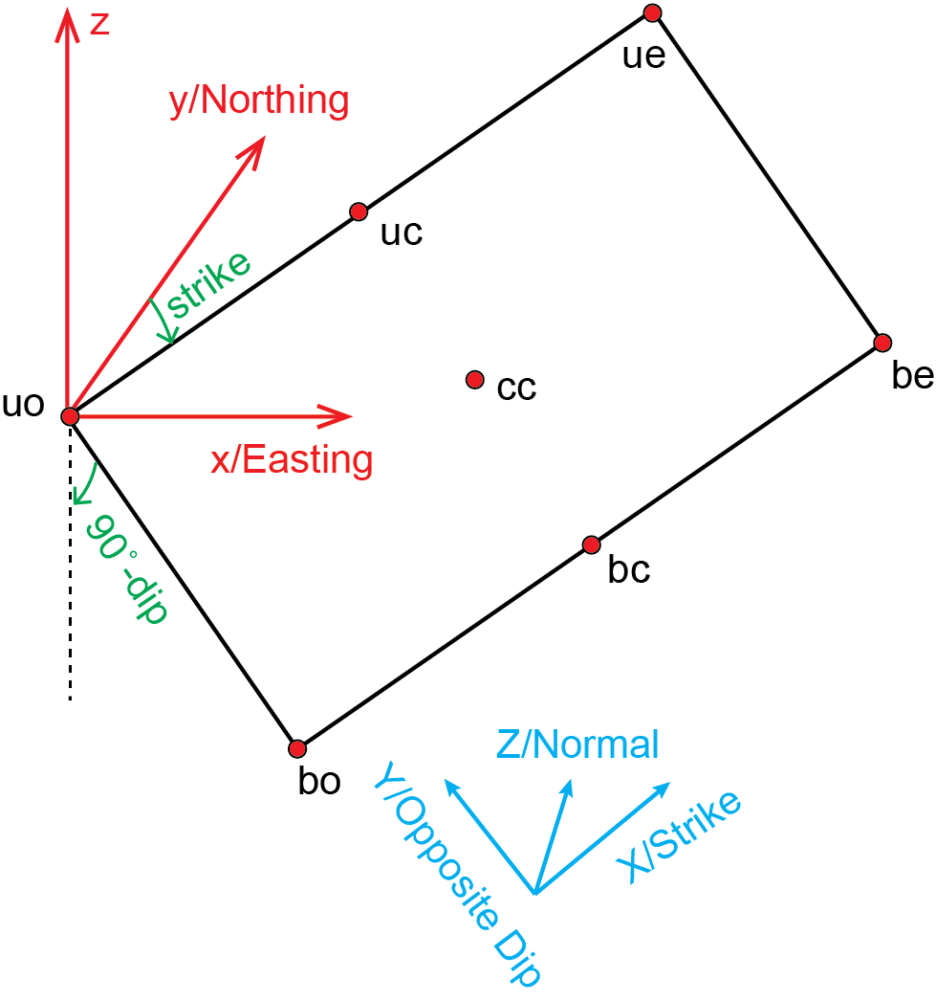

# SeiSlip 
> update: 2023-06-09 23:43  
> Zelong Guo, @ Potsdam, zelong.guo@outlook.com

Cartesian and Fault Coordinate System:

    
    
 Figure 1. The definition of cartesian and fault coordinate systems.  

